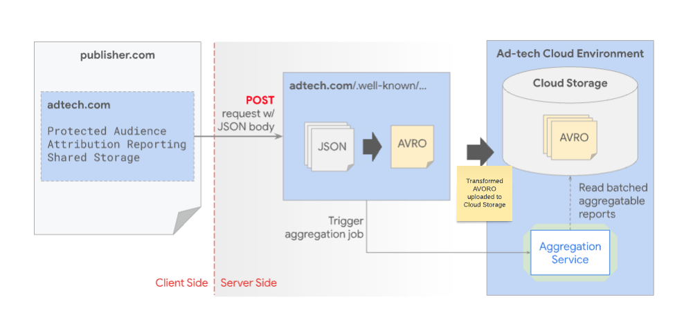
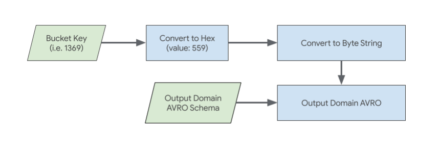

project_path: /privacy-sandbox/_project.yaml
book_path: /privacy-sandbox/_book.yaml
author_name: Patti Shin, Erin Walsh, Natalie Russell, Kyungsoo Lee, Kechy Eke, Ruchi Lohani, Maybelline Boon
refresh_date: 2024-10-24
description: Deploy and manage this service to produce summary reports for the Attribution Reporting API or the Private Aggregation API.
keywords: app:AggregationService, docType:LandingPage category:Web, category:Mobile, apiGroupAds

# Receive and Store Aggregatable Reports

## Overview

When ad techs trigger measurement APIs ([Attribution Reporting API](/privacy-sandbox/relevance/attribution-reporting) or [Private Aggregation API](/privacy-sandbox/relevance/private-aggregation)), the encrypted reports are sent from the Chrome browser / client side to the ad tech's reporting endpoint which is a `.well-known` URL with the ad tech's reporting origin. The reporting endpoint is hosted by ad tech to [collect the encrypted reports](https://github.com/privacysandbox/aggregation-service/blob/main/docs/collecting.md).




### Endpoints

Following are the endpoints per API:

#### Private Aggregation
  * Debug `[reporting-origin]/.well-known/private-aggregation/debug/report-shared-storage`
  * Live `[reporting-origin]/.well-known/private-aggregation/report-shared-storage` or `/.well-known/private-aggregation/report-protected-audience`

#### Attribution Reporting
  * Debug `[reporting-origin]/.well-known/attribution-reporting/debug/report-aggregate-attribution`
  * Live `[reporting-origin]/.well-known/attribution-reporting/report-aggregate-attribution`

Ad techs will receive the reports in JSON format through a POST call. Ad techs will collect these JSON reports and later convert them into AVRO format which is used in Aggregation Service. Once converted, the [AVRO reports](https://avro.apache.org/docs/) are stored in the ad tech's cloud storage for later batching.

Once ad tech is ready for batching, ad tech will trigger an aggregation job request through aggregation service where the reports are retrieved from the ad tech's cloud storage. Aggregation Service is hosted on the ad tech's cloud storage and should have an [allow-listed image](https://github.com/privacysandbox/aggregation-service/releases).

### Reports 

Reports received look similar to the following:

#### Private Aggregation API

```json
  {
    "aggregation_coordinator_origin": "https://publickeyservice.msmt.aws.privacysandboxservices.com",
    "aggregation_service_payloads": [ {
        "key_id": "1a2baa3f-5d48-46cf-91f0-772633c12640",
        "payload": "8Cjr1s3FVkCYkjzBvyzJn14yardVjd5N4vLCA69LQAPbIkJ0B58hAqUGBCNXpvTjW9ZpIoZbCSiUOsUDuoA/S+tqVolLMkame6sWC07cfUmZcVsbU+La3pzTMtCgdtNc8MIWgD3C63CMw7rWroRlechewVUajvAYVK/0HJq0YyGrTiFZZm36zi0jjyHLAXKV8p1Lvy1d0o/wnBxC5oVo5BV6LPkxqQEcoYS2GyixUuht6wD0RzuH+BxxuH6vY/ynp2xDrnwftjvqwDUAxUWLFTunthM6BXZVxlrvOBim1h2dvPqWSyKZ5gafo+MgW9EM4SraavNM3XzZSCjdtAfSMJMrynSu2j0opyAq+9e1jq1xeYN00yZrJ0Y/GTI45IGjgCnVmvmuoI9ucW2SnXP31CQBwHqk4gtUgMsYGFSUYfhtnAQ/8TSbaXyS2LX+cQW87LqkvIraWw6o37O24VFBreFoFFXpu3IUeCZfji+Sr4/ykfZuHeMzQbBavyNnHKzPZlbLSXMiucx4/vWzYyOzHeIlbtupXVvbi40V2PieDShaSbjI266kGgFkeCk6z51AaAGebDPtRT1lhBpcoQ6JdF0Yp5VWSnyFARKFtCZ1aEBrlUlrEHLUQY/pFtmDxJQiicRz1YPjR8jRr3C7hlRhWwov0dMocqnMz5209hHGVZWSsaGc9kWjtxREW2ULXfoIwOGbX+WZsyFW2RhXksQPJ5fhyNc4ROkAzUthLb68gC5e0yZHvmLIAU4hcWe0UanJv+jRljn8PAPaJHKFUxQNJyBA7mTbn5mkpycxGrX6T3ZYdPHqvckqt9llJZWjr8NneizzZFRuJk423BDs38fXkvcTAsAckd2Zu0u2KC45WR93sN2/CWrqB7/QU9BsgNdonl/ehAWhU1LbcRRvBTcR9+0wL7vRL7cv5LG3+gRYRKsWI6U2nDSWp0cNpo9+HU0JNiifa5X0cguihqU2bSk6ABozgRtCZ7m+7eqWXMLSzBdmc1CPUoQppo6Wmf6ujdNqI6v2S6pDH781lph8Z2v7ZpxGdhVVPEL51cVn"
    } ],
    "debug_key": "1234",
    "shared_info": "{\"api\":\"shared-storage\",\"report_id\":\"05e3b948-cb8d-4404-be29-bfeac7ad9710\",\"reporting_origin\":\"https://privacy-sandbox-demos-dsp.dev\",\"scheduled_report_time\":\"1707784729\",\"version\":\"0.1\"}"
  }
```

#### Attribution Reporting API

```json
  {
    "aggregation_coordinator_origin": "https://publickeyservice.msmt.aws.privacysandboxservices.com",
    "aggregation_service_payloads": [ {
        "key_id": "2dee0f3f-2aee-4a4a-8238-9154ed3d6f72",
        "payload": "pHvTHhcxvNKaCmnLpvYQsXlJpiNRuFO5Zj1QqUlqgWPOfuoHLfiXiFjmpvY8a53/OYnS4bKwHwJReFcofldsu8E9BzTTJ3CEk+B7vbEjnDPaljhpIBMTuQXy3QHGK4slWR/yNZVm2uXRWR/DVVzXziBoTDjN7qaPstRoLKUUMdfY2u8oq4tnLY00Y+NDZttZ4wJvC7hPmvY3lqHjdl14JPD2ytZZ4NViYzno3WKdH/oZc0jhGK4zI38lAM0qpahF/B9yb4zOu7IRIjQpNx73P8naDyddxLldoVlW/qHpO04FguWymscvI/8i6NwUR6Kj8seRlWS0iIUhETt/ai3lilKUHUb+uz0YG2kxjoXq7Ldk+MP56nNl67ZRNi2YZ7bOGI/okYWoT/wt2uWPe/5xAEMmadxl0hQQrG7YXHRSD8rDnaVPXo+AKIxdg727yJeB1ZENZvovl/kIevdRAmdBe2h1U3J6Uz6psly/46fvjgkj5QD+kO2uaYirzvmwS19luJsN/Qvh/R3ZO4qlJIQI0nDJPWwUJ4ODpyVmj4a0xQp3t2ESEnf4EmY7+khn3xpF5+MwEWKES2ZeDf7SHalR99pvZA8G3Fr8M0PWFmT00cmKCBwpQgZyd3Eay70UlqdkbFEedxiCVWKNNOUz41m5KG/7K3aR+dYx57l57Wct4gOFQg3jiUEBJWrFIVCXf12BT5iz5rBQh1N1CUt2oCOhYL/sPuBl6OV5GWHSIj8FUdpoDolqKXWINXfE88MUijE2ghNRpJN25BXIErUQtO9wFQv7zotC6d2BIaF0x8AkKg/7yzBQRySX/FZP3H3lMkpOz9rQMV8DjZ2lz7nV4k6CFo8qhT6cpYJD7GpYl81xJbglNqcJt5Pe5YUHrdBMyAFsTh3yoJvYnhQib/0xVN/a93lbYccxsd0yi375n4Xz0i1HUoe2ps+WlU8XysAUA1agG936eshaY1anTtbJbrcoaH+BNSacKiq4saprgUGl4eDjaR/uBhvUnO52WkmAGon8De3EFMZ/kwpPBNSXi7/MIAMjotsSKBc19bfg"
    } ],
    "shared_info": "{\"api\":\"attribution-reporting\",\"attribution_destination\":\"https://privacy-sandbox-demos-shop.dev\",\"report_id\":\"5b052748-f5fb-4f14-b291-de03484ed59e\",\"reporting_origin\":\"https://privacy-sandbox-demos-dsp.dev\",\"scheduled_report_time\":\"1707786751\",\"source_registration_time\":\"0\",\"version\":\"0.1\"}",
    "source_debug_key": "123456789",
    "trigger_debug_key": "123456789"
  }
```

## Convert JSON to AVRO reports

When batching, aggregatable reports need to be in AVRO format. To create an AVRO report, you will need the report AVRO schema (AVSC).

A [sample javascript code](https://github.com/privacysandbox/aggregation-service/blob/main/docs/collecting.md#collect-transform-and-batch-reports) is available on the Aggregation Service GitHub repository.

You can have 1 AVRO file for all your reports or split reports into multiple AVRO files. There is no limit on AVRO size. For performance reasons, it is recommended to keep the number of AVRO files to a number between the number of CPUs available for your Cloud instance and 1000.

The following is the AVRO Schema for Aggregatable reports. The different fields for the reports are `payload`, `key_id` and `shared_info`.

```json
  {
    "type": "record",
    "name": "AggregatableReport",
    "fields": [
      {
        "name": "payload",
        "type": "bytes"
      },
      {
        "name": "key_id",
        "type": "string"
      },
      {
        "name": "shared_info",
        "type": "string"
      }
    ]
  }
```
<table class="with-borders width-full simple fixed-table with-heading-tint">
  <thead>
    <tr>
      <th>Parameter</th>
      <th>Type</th>
      <th>Description</th>
    </tr>
  </thead>
  <tr>
    <td><code>payload</code></td>
    <td>Bytes</td>
    <td>
      Payload will need to be base64 decoded and converted to a byte array
      from <code>payload</code> for live / production reports.
    </td>
  </tr>
    <tr>
    <td><code>debug_cleartext_payload</code></td>
    <td>Bytes</td>
    <td>
      Payload will need to be base64 decoded and converted to a byte array
      from <code>debug_cleartext_payload</code> for debug reports.
    </td>
  </tr>
  <tr>
    <td><code>key_id</code></td>
    <td>String</td>
    <td>This will be the key_id string found in the report. The key_id will be a 128-bit universally unique identifier similar.</td>
  </tr>
  <tr>
    <td><code>shared_info</code></td>
    <td>String</td>
    <td>This will be the non-tampered string found in the report shared_info field.</td>
  </tr>
</table>

This an example report json:

```json
{ 
   "aggregation_coordinator_identifier": "aws-cloud",      
   "aggregation_service_payloads": [{ 
      "debug_cleartext_payload": "omRkYXhgaJldmFsdWVEAAAAgGZidWNrZXRQAAAAAAAAAAAAAAAAAAAFWW1vcGVyYX", 
      "key_id": "3c6e2850-edf6-4886-eb70-eb3f2a7a7596",
      "payload": "oapYz92Mb1yam9YQ2AnK8dduTt2RwFUSApGcKqXnG1q+aGXfJ5DGpSxMj0NxdZgp7Cq" 
   }],
   "debug_key": "1234", 
   "shared_info":
"{\"api\":\"shared-storage\",\"debug_mode\":\"enabled\",\"report_id\":\"b029b922-93e9-4d66-a8c6-8cdeec762aed\",\"reporting_origin\":\"https://privacy-sandbox-demos-dsp.dev\",\"scheduled_report_time\":\"1719251997\",\"version\":\"0.1\"}"
}
```

## Output Domain AVRO

To generate summary reports using Aggregation Service, ad tech requires the aggregatable reports and the domain file. The aggregatable reports will be the JSON reports received in the reporting origin and converted to AVRO format. Output domains will contain the pre-declared keys that will be collected from your aggregatable reports and will be written into the summary reports. Learn more about these [keys in Attribution Reporting](/privacy-sandbox/private-advertising/attribution-reporting/aggregation-keys) and [keys in Private Aggregation](/privacy-sandbox/private-advertising/private-aggregation/fundamentals#aggregation-key). Output domain will contain the field bucket and the bucket value will be your bucket key.

The domain file will also need to be in AVRO format using the following schema:

```json
  {
    "type": "record",
    "name": "AggregationBucket",
    "fields": [
      {
        "name": "bucket",
        "type": "bytes",
        "doc": "A single bucket that appears in the aggregation service output. 128-bit integer encoded as a 16-byte big-endian bytestring."
      }
    ]
  }
```

### Bucket Key

Bucket key should be an hex bytestring of the bucket key. An example for this will be having a key of 1369 in Decimal. When converted to Hex, it will be 559. Then you will need to convert 559 into a bytestring to be added into the output domain AVRO



## Batch reports

To understand more about privacy budgets and batching, go to the [batching strategies](/privacy-sandbox/private-advertising/aggregation-service/batch-strategies) doc. Also, keep in mind that an aggregatable report can only be batched within a certain period of time. A report shouldn't exceed the [MAX_REPORT_AGE](https://github.com/privacysandbox/aggregation-service/blob/941d295bafab053412207dea68a941228c53d2ff/java/com/google/aggregate/adtech/worker/model/SharedInfo.java#L61) between the `scheduled_report_time` and the batch run date (currently 90 days).

## Summary Reports

After batching, Aggregation Service creates the summary report in AVRO format. The summary report uses the `results.avsc` schema.

The summary report will be located in the `output_data_blob_prefix` in the `output_data_bucket_name` bucket stated in the `createJob` request.

For Aggregation Service batches where debug_run is enabled, it creates two reports. The summary report and the debug summary report. The debug summary report will be located in the `output_data_blob_prefix/debug` folder.

The debug report generated uses the `debug_results.avsc` schema.

Both summary and debug report will be named as `[output_data_blob_prefix]-1-of-1.avro`. If your output_data_blob_prefix is `summary/summary.avro`, the report will be in the summary folder with the name `summary-1-of-1.avro`.

### results.avsc

```json
{
  "type": "record",
  "name": "AggregatedFact",
  "fields": [
    {
      "name": "bucket",
      "type": "bytes",
      "doc": "Histogram bucket used in aggregation. 128-bit integer encoded as a 16-byte big-endian bytestring. Leading 0-bits will be left out."
    },
    {
      "name": "metric",
      "type": "long",
      "doc": "Metric associated with the bucket"
    }
  ]
}
```

### debug_results.avsc

```json
  {
  "type": "record",
  "name": "DebugAggregatedFact",
  "fields": [
      {
        "name": "bucket",
        "type": "bytes",
        "doc": "Histogram bucket used in aggregation. 128-bit integer encoded as a 16-byte big-endian bytestring. Leading 0-bits will be left out."
      },
      {
        "name": "unnoised_metric",
        "type": "long",
        "doc": "Unnoised metric associated with the bucket."
      },
      {
        "name": "noise",
        "type": "long",
        "doc": "The noise applied to the metric in the regular result."
      }
      {
        "name":"annotations",
        "type": {
          "type": "array",
          "items": {
            "type":"enum",
            "name":"bucket_tags",
            "symbols":["in_domain","in_reports"]
          }
       }
    ]
  }
```

Once converted, your summary report will look like the example `results.json`. When debug_run is enabled, the debug summary report returns something similar to example `debug_results.json`.

### results.json (example)

AVRO reports coming from Aggregation Service can look similar where you have the bucket key and the summary / aggregate value with added noise of the bucket values.

```json
  {
    "bucket": "\u0005Y",
    "metric": 26308
  }
```

### debug_results.json (example)

Debug AVRO reports coming from Aggregation Service should look similar to the following where you receive your bucket keys, `unnoised_metric` (summary of the bucket keys without noise) and the noise that is added to the `unnoised_metric`.

```json
  {
    "bucket": "\u0005Y",
    "unnoised_metric": 128,
    "noise": -17948,
    "annotations": [
      "in_reports",
      "in_domain"
    ]
  }
```

The annotations will also contain `in_reports` and / or `in_domain` which means:

 * `in_reports`: the bucket key is available inside the aggregatable reports
 * `in_domain`: the bucket key is available inside the `output_domain` AVRO file
